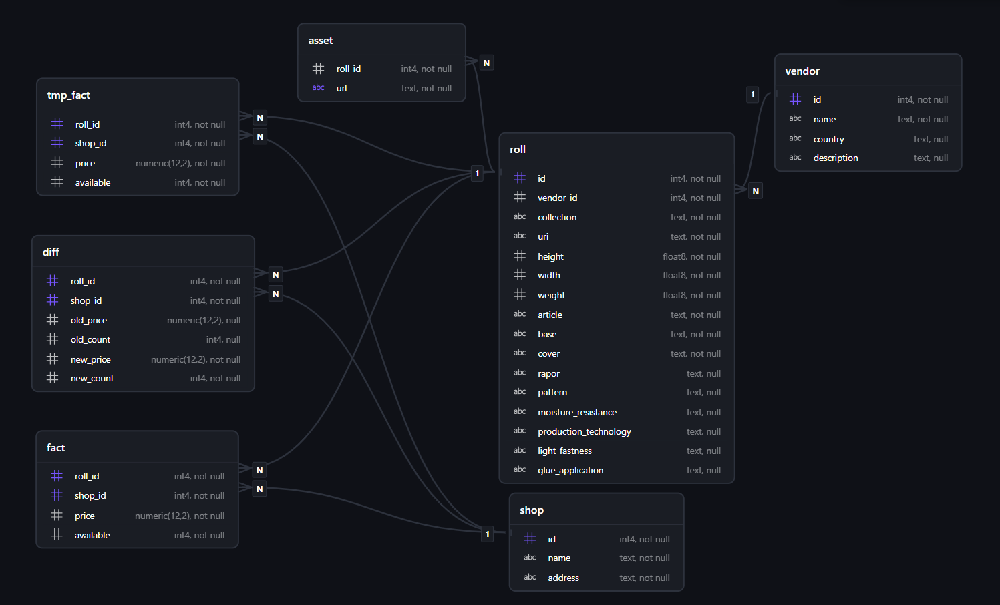

# oboykin-spy

Oboykin Spy - ваш проводник к скидкам на обои ✨🧑‍🔧 

# Описание проекта

Мониторинг сайта oboykin.ru на предмет акционных рулонов обоев. Дело в том, что летом 2025 года я сделал ремонт в комнате. Так как бюджет был ограничен, а комнаты небольшие по размеру, то идеальным вариантом было брать обои из остатков. Магазины хотят сбыть эти остатки побыстрее, чтобы освободить место для новых партий. Мне же удобно было их купить и наклеить.

# Описание DAG

В проекте используется следующий стек: Airflow, Minio S3, PostgreSQL и Telegram. Все сервисы контейнеризированы с помощью Docker.

Пайплайн выглядит так:

1. Посылаем запрос к сайту, получаем JSON с данными.
2. сохраняем его в S3.
3. Парсим JSON и сохраняем его в БД.
4. Вычисляем разницу между пришедшими данными и теми, что уже были записаны.
5. О любых изменениях в цене или наличии приходит оповещение в Telegram Bot мне в чат.

Запуск происходит 1 раз в час.

# Модель данных

Нормализована до 3 нормальной формы.



Таблицы:

1. Roll - Рулон обоев
2. Vendor - Производитель обоев
3. Asset - Фотографии рулона обоев с сайта
4. Shop - Магазин
5. tmp_fact - временная таблица для хранения только что полученных данных.
6. fact - таблица для постоянного хранения наличия
7. diff - таблица для хранения разности между только что полученными данными и уже хранимыми.

# Запуск

## Добавление подключений к Airflow

Нужно добавить два подключения: 

- Telegram Bot. Через BotFather создаем бота, в Connections указываем токен.
- PostgreSQL. Указываем все credentials для подключения.

## Создание таблиц в mart-postgres

Нужно выполнить скрипт для создания таблиц БД:

```
docker exec mart-postgres psql -U oboykin -d oboykin -f /init.sql
```

## Команды для Docker Compose

На машине должен быть установлен Docker и Docker Compose. Для запуска необходимо выполнить команду:

```
docker compose up --build -d
```

Чтобы остановить приложение:

```
docker compose down
```


